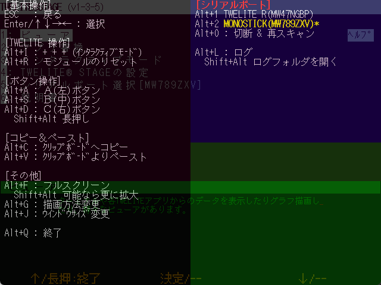
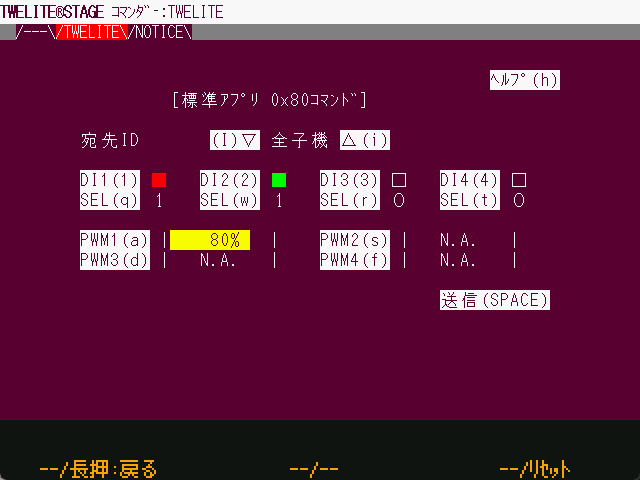

# キー操作・マウス操作

`Windows` `macOS` `Linux` `RasPi`

TWELITE STAGEアプリを通じた操作について解説します。

## キー操作
`Windows` `macOS` `Linux` `RasPi`

`ALt(Cmd)`を押しながらキー入力は TWELITE STAGE アプリの設定を変えるなどの操作です。
その他のキー操作は、通常は画面上の入力です。

### 共通のキー
`Windows` `macOS` `Linux` `RasPi`

| キー     | 意味           |
| ------ | ------------ |
| `ESC` `ESC`    | 素早く2回ESCを押す。キャンセル、前画面に戻る。画面によっては1回の`ESC`で前画面に戻ります。 |
| `Enter`  | 入力、選択        |
| カーソル↑↓ | 項目の選択        |

### ヘルプ画面
`Windows` `macOS` `Linux` `RasPi` 

Windows/macOS/Linuxでは、**Alt\(またはCmd\)を押し続ける**ことでヘルプ画面を表示します。ヘルプ画面ではAlt\(Cmd\)と一緒に操作できるキーの説明や一部動作状況を表示します。


ヘルプ画面は**画面の左上部分にマウスポインタを移動**しても表示します


### Alt(Cmd)+操作

`Windows` `macOS` `Linux` `RasPi`

Windows/macOS/LinuxでのAlt(Cmd)を押しながらの操作について解説します。表中ではAlt(Cmd)+の表記は省略しています。Alt(Cmd)を押すとヘルプ画面が出てきて使用可能なキーは確認できますが、下表に補足します。

| `Alt(Cmd)`+キー              | 意味          |
|--------|--------|
| `I`            | + + + を入力します。インタラクティブモードに入るキーシーケンスです。 ※ スリープによる間欠動作を行うアプリは + + + ではインタラクティブモードになりません。                                                                   |
| `R`               | モジュールをリセットする。TWELITE R や MONOSTICK の機能を用いてリセットピンの制御を行います。                                                                                                         |
| `A`, `S`, `D`         | A, B, C ボタンを押します。                                                                                                                                                 |
| `Shift` + `A`, `S`, `D` | A, B, C ボタンを長押しします。                                                                                                                                               |
| `C`               | 表示されている画面の文字列をクリップボードにコピーします。（画面によって範囲は異なります）                                                                                                                     |
| `V`               | クリップボードからキーボード入力としてペーストします。                                                                                                                                       |
| `F`               | フルスクリーンに遷移します。Shift+Fは、可能であれば、より拡大します。                                                                                                                            |
| `G`               | 画面の描画方法を変更します。640x480の液晶画面をエミュレートしていますが、拡大時の描画方式として（1. 液晶モニタ風の描画 / 2. ブラウン管風の描画  / 3. ドットを目立たせた拡大 / 4. ドットをぼやかせた拡大）の４種類が選択できます。※ 設定メニューで起動時設定にできます。 |
| `J`               | 画面サイズを選択します。選択可能な画面サイズは {640,480}, {1280, 720}, {1280,960}, {1920,1440}, {2560,1440}, {320,240} です。 ※ 設定メニューで起動時設定にできます。                                           |
| `Q`               | TWELITE STAGE を終了します。                                                                                                                                             |
| `0`               | シリアルポートを切断し、再度シリアルポートの一覧を表示します。                                                                                                                                   |
| `1`,`2`,..          | シリアルポートを選択します。                                                                                                                                                    |
| `L`, `Shift`+`L`            | シリアルポートの入出力のログを開始します。終了時にはログファイルが Windows であればメモ帳、macOS であれば ログビューアで開かれます。`Shift`+`L` でログ格納フォルダを開きます。                                                                 |

#### その他の操作
| キー              | 意味          |
|--------|--------|
| `Alt(Cmd)`+`Shift`+`Ctrl`+`m` | MWX ライブラリコードのﾌｫﾙﾀﾞを開く |
| `Alt(Cmd)`+`Shift`+`l` | log ﾌｫﾙﾀﾞを開く |

## マウス操作
`Windows` `macOS` `Linux` `RasPi`

マウスは、左クリックが中心ですが、右クリック、右ダブルクリック、ホイールを使う場合があります。

| マウス操作     | 意味           |
| ------ | ------------ |
| 左クリック    | 選択 |
| 左クリックしながらドラッグ    | 画面によって利用（グラフ画面でのドラッグ） |
| 左ダブルクリック    | 使用しない |
| 右クリック    | 画面によって利用        |
| 右ダブルクリック    | 画面から脱出(`ESC` `ESC`と同様)      |
| ホイール | 画面によって利用（グラフ画面で拡大縮小）        |

### マウスによるA,B,Cボタン
`Windows` `macOS` `Linux` `RasPi`

TWELITE STAGE アプリは、3つ並びのハードウェアボタンを模したメニューに画面ごとの機能が割り当てられています。
画面下部のメニュー表示にマウスポインタを移動すると、`[ A ]`, `[ B ]`, `[ C ]` という表記のボタンが表示されます。このボタンを左クリックまたは左長押しクリックすることで、機能を選択できます。（`Alt(Cmd)`+`a`,`s`,`d` または　`Alt(Cmd)`+`Shift`+`a`,`s`,`d`でも選択可能）

![画面下部の仮想\[ B \]ボタンが表示されている例](../.gitbook/assets/img_vbtn_b.png)

### マウスによる画面中の操作
`Windows` `macOS` `Linux` `RasPi`

Windows/macOS/Linuxでは、TWELITE STAGE の画面構成は原則文字列のみで構成されますが、メニューやボタン、タブについてはマウスによる操作が可能です。

テキストのみの構成ですが、画面上部のタブや、反転表示の文字はマウスの左クリックで選択可能です。
