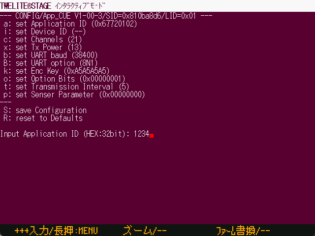

# インタラクティブモード

`Windows` `macOS` `Linux` `RasPi`

インタラクティブモードへの遷移と操作を行います。



この画面はターミナルとほぼ同じ振る舞いをしますが、インタラクティブモード遷移のための操作と離脱の検出を行うなど、インタラクティブモードに固有の機能が追加されています。

* 接続される TWELITE 無線モジュールには、インタラクティブモードに対応したファーウェアが書き込まれている必要があります。
* TWELITE無線マイコンからの入出力を用いて動作しているため、シリアル通信に文字化けなどが発生した場合など、期待通りにインタラクティブモードへの遷移や離脱が出来ない場合もあります。
* マウス操作には対応してません。キーボード（カーソル↑↓での操作は可能）操作になります。


[ターミナル](viewer/terminal.md)によるインタラクティブモードへの遷移と操作も可能です。

* ターミナルではSETピンの操作は行わないため、手動でSETピンをLOに設定する必要があります。
* \+ + + 入力`Alt(Cmd)+I`やモジュールリセット`Alt(Cmd)+R`を行う操作は定義されています。



### インタラクティブモード画面の動作フロー

大まかな処理の流れを記載します。

```
[画面黒背景にする]
  ↓
[TWELITE無線マイコンリセット (制御可能ならSET=LO)]
  ↓
<間欠動作アプリのインタラクティブモードメッセージを検出？> --YES--> [操作画面]へ
  ↓タイムアウト
['+' を３回入力]
  ↓
<通常アプリのインタラクティブモードメッセージを検出？> --YES--> [操作画面]へ
  ↓タイムアウト
[操作画面へ] ※ この状態はインタラクティブモードではない

[操作画面]
  ↓
<インタラクティブモード脱出メッセージ?> --> [終了]
  ↓
<画面離脱操作 [ A ] 長押しなど> --> [終了]
  ↓
<ESC ?> -> <入力中判定> --NO-> [終了]
  ↓            ↓
[入力文字列をTWELITE無線モジュールへ送信]
  ↓
[操作画面]へ戻る

[終了]
  ↓
[TWELITE無線マイコンリセット]
  ↓
[画面離脱] インタラクティブモード画面を終了し前の画面へ戻る  
```
