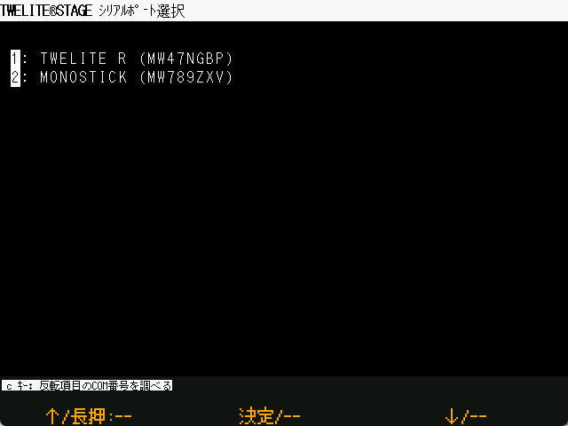

# シリアルポート選択

`Windows` `macOS` `Linux` `RasPi` 

Windows/macOS/Linux では、始動時にTWELITE無線マイコンが接続されているシリアルポートを選択する画面が表示されます。
シリアルポートはこの画面で選択しなくても、あとから接続できます。


TWELITE STAGEアプリでは、シリアルポートの選択と各画面の処理は連携していません。
例えば、シリアルポートの選択をしない状態で、ビューアを起動しても表示が更新されません。この状態でシリアルポートを
選択すると表示が更新されます。

シリアルポートは `Alt(Cmd)+0,1,2,...` のキー操作でいつでも切り替えが可能です。


#### Windows

`c`キーを押すと、リストで反転中のシリアルポートのCOMポート名が表示されます。

#### RasPi

Raspberry Pi ではUSBデバイスに加えて`/dev/serial0` `/dev/serial1`があれば `serial0`, `serial1` が表示されます。通常は`serial0`を使用します。

